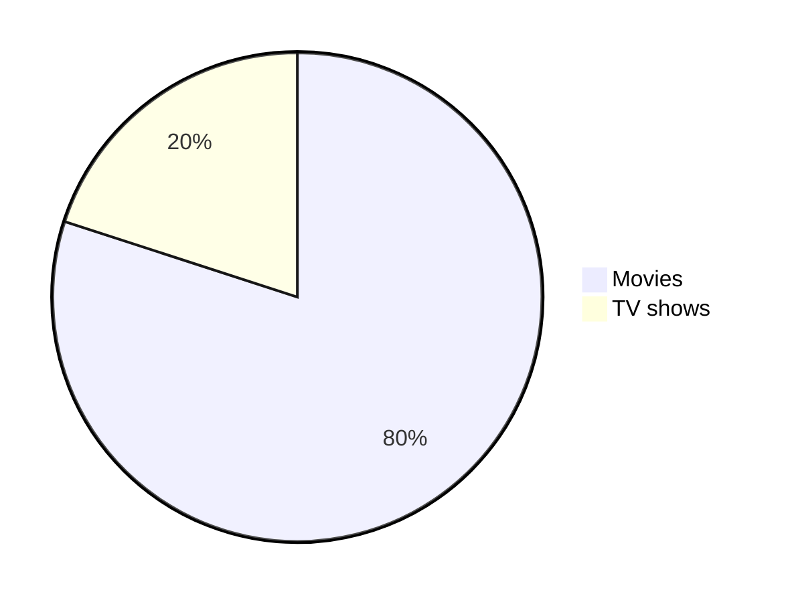

# TEST

---

## BLOCKQUOTES

Blockquote: 

> The quick brown fox jumps over the lazy dog.

<br>

> The quick brown fox jumps over the lazy dog.
>
> The quick brown fox jumps over the lazy dog.
>
> The quick brown fox jumps over the lazy dog.

<br>

> The quick brown fox jumps over the lazy dog.
>> The quick brown fox jumps over the lazy dog.
>>> The quick brown fox jumps over the lazy dog.

<br>

> **The quick brown fox** *jumps over the lazy dog.*

<br>

> # Heading 1
> The quick brown fox jumps over the lazy dog.

---

## SEARCH

Search form:  

<form action="?" method="get">
<label for="search">SEARCH</label>
<input type="text" name="search">
<button type="submit">SEARCH</button>
</form>

Search:  

{search}

Search code block:  

```html
{search}
```

## FEEDS

FEEDS:  

```html
{feeds}
```

### RSS

RSS:  

```html
{rss}
```

RSS Location:  
[{rss-location}]({rss-location})

RSS URL:  
[{rss-url}]({rss-url})

### Atom

Atom:  

```html
{atom}
```

Atom location:  
[{atom-location}]({atom-location})

Atom URL:  
[{atom-url}]({atom-url})

### JSON

JSON:  

```html
{json}
```

JSON location:  
[{json-location}]({json-location})

JSON URL:  
[{json-url}]({json-url})

---


## DATES

**{date}**

```html
$date  
```

```html
{$date}
```

---

## Relative dates

{relative_date}

```html
{relative_date}  
```

$relative_date  

```html
{$relative_date}
```

---

## Permalink & Location

[{permalink}]({permalink})

[{location}]({location})


---

## MARKDOWN (HTML)

---

# Heading 1
## Heading 2
### Heading 3
#### Heading 4
##### Heading 5
###### Heading 6

---

The quick brown fox jumps over the lazy dog.

---

**The quick brown fox jumps over the lazy dog.**

---

*The quick brown fox jumps over the lazy dog.*

---

***The quick brown fox jumps over the lazy dog.***

---

<samp>The quick brown fox jumps over the lazy dog.</samp>

---

<ins>The quick brown fox jumps over the lazy dog.</ins>

---

~~The quick brown fox jumps over the lazy dog.~~

---

<pre>
Lorem ipsum dolor sit amet, consectetur adipiscing elit. <strike>Sed do eiusmod tempor incididunt ut labore et dolore magna
aliqua.</strike> Ut enim ad minim veniam, quis nostrud exercitation ullamco laboris nisi ut aliquip ex ea commodo consequat.
Duis aute irure dolor in reprehenderit in voluptate velit esse cillum dolore eu fugiat nulla pariatur. <strike>Excepteur sint
occaecat cupidatat non proident, sunt in culpa qui officia deserunt mollit anim id est laborum.</strike>
</pre>

---

<strike>

```js
console.log('Error');
```

</strike>

---

<table><tr><td>The quick brown fox jumps over the lazy dog.</td></tr></table>

---

<sub>The quick brown fox jumps over the lazy dog.</sub>

---

<sup>The quick brown fox jumps over the lazy dog.</sup>

---

<sup><sub>The quick brown fox jumps over the lazy dog.</sub></sup>

---

<sub><sup>The quick brown fox jumps over the lazy dog.</sup></sub>

---

The quick\
brown fox\
jumps over\
the lazy dog.

---

```
public static String monthNames[] = {"January", "February", "March", "April", "May", "June", "July", "August", "September", "October", "November", "December"};
```

---

```diff
## git diff a/test.txt b/test.txt
diff --git a/a/test.txt b/b/test.txt
index 309ee57..c995021 100644
--- a/a/test.txt
+++ b/b/test.txt
@@ -1,8 +1,6 @@
-The quick brown fox jumps over the lazy dog
+The quick brown fox jumps over the lazy cat

 a
-b
 c
 d
-e
 f
```

---

```diff
- Text in Red
+ Text in Green
! Text in Orange
# Text in Gray
@@ Text in Purple and bold @@
```

---

<p align="left">

</p>

---

<p align="center">

</p>

---

<p align="right">

</p>

---

<h3 align="center"> My latest Medium posts </h3>

---

<table>
<tr>
<td width="33%">
The quick brown fox jumps over the lazy dog.
</td>
<td width="33%">
The quick brown fox jumps over the lazy dog.
</td>
<td width="33%">
The quick brown fox jumps over the lazy dog.
</td>
</tr>
</table>

---

<table>
<tr>
<th>Heading 1</th>
<th>Heading 2</th>
</tr>
<tr>

<td>

| A | B | C |
|--|--|--|
| 1 | 2 | 3 |

</td><td>

| A | B | C |
|--|--|--|
| 1 | 2 | 3 |

</td></tr> </table>

---

| A | B | C |
|---|---|---|
| 1 | 2 | 3 <br/> 4 <br/> 5 |

---

[The-Ultimate-Markdown-Cheat-Sheet](https://github.com/lifeparticle/Markdown-Cheatsheet)

---

[The-Ultimate-Markdown-Cheat-Sheet][reference text]

[The-Ultimate-Markdown-Cheat-Sheet][1]

[Markdown-Cheat-Sheet]

[reference text]: https://github.com/lifeparticle/Markdown-Cheatsheet
[1]: https://github.com/lifeparticle/Markdown-Cheatsheet
[Markdown-Cheat-Sheet]: https://github.com/lifeparticle/Markdown-Cheatsheet

---

Footnote.[^1]

Some other important footnote.[^2]

[^1]: This is footnote number one.
[^2]: Here is the second footnote.

---

[Example of a relative link](rl.md)

---

Visit: https://luxury-format.weblog.lol

---

Email at: luxury-format@omg.lol

---

<https://luxury-format.weblog.lol>

---

[BinaryTree](https://binarytree.dev/)

---


---

![alt text][image]

[image]: https://images.unsplash.com/photo-1415604934674-561df9abf539?ixlib=rb-1.2.1&ixid=eyJhcHBfaWQiOjEyMDd9&auto=format&fit=crop&w=100&q=80 "Title text"

---


---


---


---


---


---

[](https://binarytree.dev/)

---

<a href='https://binarytree.dev/' target='_blank'>  </a>

---

<picture>
  <source media="(prefers-color-scheme: dark)" srcset="https://github.com/lifeparticle/lifeparticle/blob/master/gh_social_dark.png">
  <source media="(prefers-color-scheme: light)" srcset="https://github.com/lifeparticle/lifeparticle/blob/master/gh_social_light.png">
  
</picture>

---

[![Badge][Logo-dark]](https://binarytree.dev#gh-dark-mode-only)
[![Badge][Logo-light]](https://binarytree.dev#gh-light-mode-only)

[Logo-dark]: https://github-readme-stats.vercel.app/api?username=lifeparticle&theme=graywhite&show_icons=true#gh-light-mode-only
[Logo-light]: https://github-readme-stats.vercel.app/api?username=lifeparticle&theme=dark&show_icons=true#gh-dark-mode-only

---

<a href="https://github.com/anuraghazra/github-readme-stats#gh-light-mode-only">
  
</a>
<a href="https://github.com/anuraghazra/github-readme-stats#gh-dark-mode-only">
  
</a>

---

<p>
  
  
  
</p>

---

<p>
  
  
  
</p>

---

<p>
  
  <br>
  
  <br>
  
</p>

---

<p>
  
  <br><br>
  
  <br><br>
  
</p>

---


---

https://github.com/user-attachments/assets/90c624e0-f46b-47a7-8509-97585dc3688a

---

1. One
2. Two
3. Three

---

1. First level
    1. Second level
        - Third level
            - Fourth level
2. First level
    1. Second level
3. First level
    1. Second level

---

* 1
* 2
* 3

+ 1
+ 2
+ 3


- 1
- 2
- 3

---

- First level
  - Second level
    - Third level
      - Fourth level
- First level
  - Second level
- First level
  - Second level

---

<ul>
<li>First item</li>
<li>Second item</li>
<li>Third item</li>
<li>Fourth item</li>
</ul>

---

- [x] Fix Bug 223
- [ ] Add Feature 33
- [ ] Add unit tests

---

<kbd>cmd + shift + p</kbd>

---

<kbd> <br> cmd + shift + p <br> </kbd>

---

<kbd>[Markdown-Cheatsheet](https://github.com/lifeparticle/Markdown-Cheatsheet)</kbd>

---

[<kbd>Markdown-Cheatsheet</kbd>](https://github.com/lifeparticle/Markdown-Cheatsheet)

---

<kbd> <br> [Markdown-Cheatsheet](https://github.com/lifeparticle/Markdown-Cheatsheet) ↗️ <br> </kbd>

---

<details>
  <summary>Markdown</summary>

-  <kbd>[Markdown Editor](https://binarytree.dev/me)</kbd>
-  <kbd>[Table Of Content](https://binarytree.dev/toc)</kbd>
-  <kbd>[Markdown Table Generator](https://binarytree.dev/md_table_generator)</kbd>

</details>

---

---
***
___

---



---

This is an inline math expression $x = {-b \pm \sqrt{b^2-4ac} \over 2a}$

---

$$
x = {-b \pm \sqrt{b^2-4ac} \over 2a}
$$

---

> [!NOTE]
> Essential details that users should not overlook, even when browsing quickly.

<br>

> [!TIP]
> Additional advice to aid users in achieving better outcomes.

<br>

> [!IMPORTANT]
> Vital information required for users to attain success.

<br>

> [!WARNING]
> Urgent content that requires immediate user focus due to possible risks.

<br>

> [!CAUTION]
> Possible negative outcomes resulting from an action.

---

https://github.com/lifeparticle/Markdown-Cheatsheet/issues/1
https://github.com/lifeparticle/Markdown-Cheatsheet/pull/10

---

HTML Comment:  

<!--
Lorem ipsum dolor sit amet
-->

---

* Asterisk
\ Backslash
` Backtick
{} Curly braces
. Dot
! Exclamation mark
# Hash symbol
- Hyphen symbol
() Parentheses
+ Plus symbol
[] Square brackets
_ Underscore`

---

\* Asterisk
\\ Backslash
\` Backtick
\{} Curly braces
\. Dot
\! Exclamation mark
\# Hash symbol
\- Hyphen symbol
\() Parentheses
\+ Plus symbol
\[] Square brackets
\_ Underscore

---

<table><tr><td> <br> The quick brown fox jumps over the lazy dog. <br> </td></tr></table>

---

<table><tr><td> <br><br><br> The quick brown fox jumps over the lazy dog. <br><br><br> </td></tr></table>

---

[&uarr;](#top)
